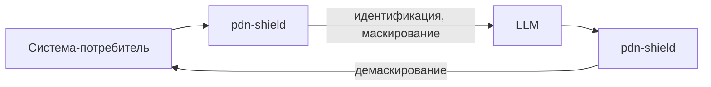
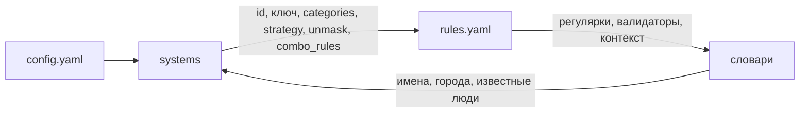

# pdn-shield

Сервис маскирует персональные данные перед отправкой в LLM и демаскирует ответ. Он встраивается в цепочку «система-потребитель - LLM» и не даёт исходным данным уйти наружу.

```
Система -> pdn-shield [детект -> маска] -> LLM -> [демаска] -> Система
```





Сервис находит ПД в тексте, заменяет их на безопасные значения и сохраняет соответствие. Ответ модели сервис восстанавливает обратно. Исходные данные не покидают сервис и не попадают в логи.

## Быстрый старт

Скопируйте конфиг, задайте ключ шифрования и запустите сервис с локальным конфигом через `PDN_CONFIG`.

```bash
cp configs/config.yaml configs/local.yaml
export PDN_ENC_KEY=$(openssl rand -hex 32)
PDN_CONFIG=configs/local.yaml make run
```

Сервис поднимется на `:8080`. Проверьте здоровье.

```bash
curl -s localhost:8080/healthz
```

Маскирование через контракт чекера.

```bash
curl -s -X POST localhost:8080/process \
  -H 'Content-Type: application/json' \
  -d '{"payload":"Клиент Иванов Иван Иванович, паспорт 4509 123456, тел +7 (916) 123-45-67","payload_id":"doc1"}'
```

Ответ содержит замаскированный текст. Тот же `payload_id` с замаскированным текстом вернёт исходник.

```bash
curl -s -X POST localhost:8080/process \
  -H 'Content-Type: application/json' \
  -d '{"payload":"<замаскированный текст>","payload_id":"doc1"}'
```

Ключ демо-системы задаётся переменной окружения `PDN_DEMO_KEY` при запуске, для стенда его выдаём отдельно.

Маскирование с генерацией id.

```bash
curl -s -X POST localhost:8080/mask \
  -H 'X-System-Id: demo' -H "X-API-Key: $PDN_DEMO_KEY" \
  -H 'Content-Type: application/json' \
  -d '{"text":"Клиент Иванов Иван Иванович, тел +7 (916) 123-45-67"}'
```

Демаскирование по id.

```bash
curl -s -X POST localhost:8080/unmask \
  -H 'X-System-Id: demo' -H "X-API-Key: $PDN_DEMO_KEY" \
  -H 'Content-Type: application/json' \
  -d '{"id":"<id из /mask>","text":"<замаскированный текст>"}'
```

Прокси в LLM.

```bash
curl -s -X POST localhost:8080/v1/chat/completions \
  -H 'X-System-Id: demo' -H "X-API-Key: $PDN_DEMO_KEY" \
  -H 'Content-Type: application/json' \
  -d '{"messages":[{"role":"user","content":"Клиент Иванов Иван Иванович, тел +7 (916) 123-45-67"}]}'
```

Демо-страница лежит на `GET /`. Она ходит в те же эндпоинты и показывает найденные типы ПД и замаскированный текст.

## Проверка для жюри

Стенд развёрнут на https://alfa-hakaton-prod.ru. Демо-страница открывается по адресу https://alfa-hakaton-prod.ru, система `demo` включена, ключ выдаём отдельно. Вставьте текст с ПД и нажмите «Маскировать», страница покажет найденные типы и замаскированный текст. Тот же `payload_id` с замаскированным текстом вернёт исходник. После «Отправить в LLM» страница показывает три стадии: что ушло в модель, сырой ответ со звёздочками и ответ после демаскирования.

Контракт чекера через `curl` на тексте с восемью и более типами ПД.

```bash
curl -s -X POST https://alfa-hakaton-prod.ru/process \
  -H 'Content-Type: application/json' \
  -d '{"payload":"Клиент Иванов Иван Иванович, паспорт 4509 123456, тел +7 (916) 123-45-67, email ivanov@mail.ru, ИНН 500100732259, СНИЛС 112-233-445 95, карта 4111 1111 1111 1111, дата 12.03.1990","payload_id":"doc1"}'
```

Ответ содержит замаскированный текст. Повторите запрос с тем же `payload_id` и замаскированным текстом, сервис вернёт исходник. Ловушки не маскируются: «Пушкин» остаётся именем, «отделение банка» не считается адресом.

Тело `/process` без поля `payload` вернёт 400, `payload_id` длиннее 256 байт тоже вернёт 400. Лишние данные после JSON-объекта в теле сервис отклоняет как 400, а не пытается их разобрать.

Система `checker` работает без ключа (`api_key: ""`), но только на `POST /process`: любой другой маршрут с `X-System-Id: checker` вернёт 403, даже если заголовок подставлен явно. Это не временная дыра, а рабочий режим: у системы без ключа просто нет доступа за пределы одного эндпоинта. У системы с `api_key_env` пустая переменная окружения не работает как «отключить ключ»: сервис ответит 401 и не пропустит запрос без валидного ключа.

Каждая запись хранит систему, которая её создала. Чужая система не может её демаскировать: `/unmask` вернёт 404, как для несуществующего `id`. Не может и перезаписать: `/mask` с тем же `id` вернёт 409. В `/process` запрос от чужой системы с уже занятым `payload_id` не трогает существующую запись, а маскирует текст заново и отдаёт результат без сохранения. Если `payload_id` известен, но пришедший текст не совпадает ни с оригиналом, ни с сохранённой маской (или совпадает лишь частично), сервис возвращает его в свежей маске, а не пытается восстановить по обрывкам. Запрет `unmask: false` действует на каждом таком пути. Если восстанавливать нечего или нельзя, ответ всегда свежая маска, а не сырой текст.

Переключение систем. `chatbot` маскирует, но не демаскирует: `/unmask` вернёт 403. `legacy_crm` выключен, любой запрос вернёт 403.

```bash
curl -s -X POST https://alfa-hakaton-prod.ru/unmask \
  -H 'X-System-Id: chatbot' -H "X-API-Key: $PDN_CHATBOT_KEY" \
  -H 'Content-Type: application/json' \
  -d '{"id":"doc1","text":"<замаскированный текст>"}'
```

Логи смотрятся так, в записи `found` только категории и счётчики, без значений; `payload_id` в логах это HMAC от исходного id, а не он сам.

```bash
kubectl -n pdn logs -l app=pdn-shield --tail=20
```

Пример строки: `msg=request system=demo route=/process direction=mask status=200 duration_ms=14 detect_ms=3 mask_ms=2 store_ms=1 found=name:1,phone:1`.

Мониторинг: дашборд «pdn-shield» в Grafana https://grafana.alfa-hakaton-prod.ru, кластер в Headlamp https://k8s.alfa-hakaton-prod.ru. Публичный LoadBalancer открывает только порт 8080, `/metrics` через него недоступен.

Новый тип ПД добавляется правилом в `internal/pii/detectors/rules.yaml`. Пример полиса ОМС: 16 цифр с контекстом «полис» или «омс».

```yaml
- name: oms_policy
  category: id_document
  pattern: '(?i)\b\d{16}\b'
  require_context: true
  context: [полис, омс]
```

Валидатор из списка (luhn, inn, snils, passport, phone, date) необязателен, неизвестный валидатор останавливает запуск. Файл правил встроен в образ, новое правило требует пересборки образа (одна команда деплоя). Это ограничение отмечено в плане развития (внешний файл правил через `PDN_RULES`).

## Какие данные находит сервис

Сервис находит следующие категории. Категория попадает в поле `found` логов и в токены стратегии `token`.

| Категория | Примеры форм |
| --- | --- |
| `full_name` | Иванов Иван Иванович, И. И. Иванов, имя и отчество без фамилии («Иван Иванович позвонил вчера»), латиница строчными после метки «name:», нижний регистр после «клиент:», тюркские отчества кызы/оглы; слова вроде «поручитель», «заёмщик», «мой брат» перед известным именем отменяют исключение для знаменитостей |
| `birth_date`, `date` | 12.03.1990, 5 марта 1990, 05 мар 1985, 1990-03-12, дата словами «пятого марта тысяча девятьсот девяностого года» |
| `passport_date` | дата после «выдан» |
| `passport` | 4509 123456, серия 45 09 номер 123456, «4509 №123456» |
| `passport_issuer` | ОУФМС России по г. Москве, ТП № 71 отдела УФМС, консульство и посольство как орган выдачи |
| `division_code` | 770-001, код с пробелом вместо дефиса |
| `birth_place` | г. Тула, с. Большие Кайбицы Кайбицкого района, небольшие населённые пункты в нижнем регистре |
| `citizenship` | Россия, Республика Беларусь, гражданин Узбекистана; распознаются все государства-члены ООН, для остальных стран разбор по метке «гражданство» |
| `driver_license` | 77 12 345678, в/у 7712345678, серия буквами с пробелами («77 АА 123456») |
| `foreign_passport` | AB1234567 при контексте загранпаспорта |
| `id_document` | военный билет АБ 1234567, ВНЖ 82 №1234567, свидетельство о рождении II-МЮ №123456 |
| `address` | индекс, город, улица, дом, квартира; полный адрес и отдельные компоненты с метками, в том числе через «=»; «живу по адресу» перекрывает исключение для адресов офисов |
| `phone` | +7 916 123-45-67, 8 (4872) 36-01-22, международные +998, десять цифр без кода страны после метки «тел.» |
| `email` | ivanov@mail.ru; личный email на банковском домене маскируется, сервисные адреса вроде info@, support@ нет; юникод-буквы в адресе маскируются полностью (élise@) |
| `inn` | 12 цифр физлица, в том числе с пробелами при метке; 10-значный ИНН организации не маскируется |
| `snils` | 112-233-445 95, 11223344595 |
| `card_number` | 16-19 цифр с проверкой Луна, в том числе с неразрывными пробелами между группами |
| `cvv` | три цифры с меткой; слово «пароль» после значения маску не снимает |
| `pin` | четыре цифры с меткой; слово «пароль» после значения маску не снимает |
| `card_holder` | IVAN IVANOV на карте, включая имя и фамилию из четырёх слов |

Число с меткой (ИНН, СНИЛС, карта) маскируется даже при неверной контрольной сумме, чтобы опечатка не привела к утечке. Без метки проверка контрольной суммы строгая. Даты словами распознаются, включая составные годы («тысяча девятьсот шестьдесят второго»). Категория `date` уточняется до `birth_date` или `passport_date` по ближайшему контексту.

## Настройка систем-потребителей

Каждая система описана в `configs/config.yaml` в блоке `systems`. Чтобы добавить систему, добавьте блок с уникальным `id` и `enabled: true`. Ключ задаётся переменной окружения через `api_key_env`, либо литералом `api_key` для системы без ключа (как `checker`); такая система работает только на `POST /process`. Список `categories` ограничивает типы ПД, а `strategy` выбирает вид замены. Флаг `unmask` разрешает демаскирование, флаг `allow_strategy_override` разрешает менять стратегию в запросе.

### Подробнее о полях

Пустой список `categories` разрешает все типы ПД. Флаг `unmask` по умолчанию выключен, флаг `allow_strategy_override: true` даёт переопределять стратегию на каждый запрос полем `strategy` в `/mask` и в прокси `/v1/chat/completions`, по умолчанию он тоже выключен. Если у системы задан `api_key_env`, но соответствующая переменная окружения пуста или не задана, сервис отвечает 401 на любой запрос этой системы. Так исключается случай, когда забытая переменная окружения тихо превращает систему в систему без ключа.

Поле `combo_rules` включает контекстное маскирование: категория маскируется только если в том же тексте найдена одна из категорий из `requires_any`. Например, в `configs/config.yaml` для системы `chatbot` задано правило, что `pin` маскируется только вместе с `card_number`. Запрос к `https://alfa-hakaton-prod.ru/mask` с заголовком `X-System-Id: chatbot` и текстом «пин-код 1234» без карты вернётся без маски, а текст «карта 4111 1111 1111 1111, пин-код 1234» замаскирует и карту, и PIN.

## Стратегии маскирования

| Стратегия | Пример | Описание |
| --- | --- | --- |
| `partial` | `Иванов Иван Иванович` - `И. И. И.`, `4509 123456` - `45** ****56` | Частично открывает символы по правилам категории (инициалы, первые/последние цифры). |
| `full` | `Иванов Иван Иванович` - `****** **** ********`, `+7 (916) 123-45-67` - `+* (***) ***-**-**` | Полностью скрывает значение: каждая буква и цифра заменяется на `*`, остальные символы (пробелы, точки, дефисы, скобки, `№`, запятые, `@`) остаются на месте. |
| `token` | `Иванов Иван Иванович` - `[FULL_NAME_1]` | Заменяет значение на токен `[КАТЕГОРИЯ_N]`; одинаковые значения в документе получают одинаковый токен. |
| `synthetic` | `Иванов Иван Иванович` - `Смирнов Пётр Сергеевич` | Генерирует правдоподобное фейковое значение того же формата, детерминированно от исходного; для форматов без своего генератора (не 16-значная карта, не 11-значный СНИЛС и т.п.) отдаёт токен `[КАТЕГОРИЯ_N]`, а не исходное значение. |

В примере из технического задания эталонная маска частичная: «И. И. И.», «45** ****56». По итогам вопроса в чате хакатона организаторы ответили, что полное скрытие значения оценивается чуть выше частичного, поэтому система `checker` в `configs/config.yaml` настроена на `full`. Это одна строка конфига, при необходимости переключается обратно на `partial`. `full` прячет каждую букву и цифру, оставляя только структуру, и не маскирует служебные слова («серия», «ул.»), которые штрафуются как избыточное маскирование. Система `demo` остаётся на `partial` и может переопределять стратегию на странице.

## Добавление нового типа ПД

Простые типы добавляются правилом в `internal/pii/detectors/rules.yaml`. Укажите имя, категорию, регулярное выражение и валидатор. Сложные типы, вроде имён или адресов, получают отдельный Go-детектор в `internal/pii/detectors`. Детектор реализует интерфейс `pii.Detector` и регистрируется в `Default()`. Правки в pipeline и resolve не нужны.

## Логи, метрики и хранение

Логи пишутся в JSON через `log/slog`. На каждый запрос одна запись с полями `system`, `route`, `status`, `duration_ms`, `found` и другими. Текст, значения спанов и ключи в логи не попадают, `payload_id` пишется как HMAC, а не в исходном виде. 429 от перегрузки и отказы аутентификации записываются в тот же лог запроса и в те же метрики, что и обычные ответы: отклонённый запрос не выпадает из наблюдаемости.

Метрики отдаёт `GET /metrics` в формате Prometheus, но не на основном порту 8080, а на отдельном `server.metrics_addr` (по умолчанию `:9090`). Наружу через LoadBalancer открыт только 8080, порт метрик доступен только внутри кластера, Prometheus скрейпит его через `ServiceMonitor`.

RPS по маршруту.

```promql
sum(rate(pdn_requests_total[5m])) by (route)
```

Латентность по маршруту.

```promql
histogram_quantile(0.95, sum(rate(pdn_request_duration_seconds_bucket[5m])) by (le, route))
```

TPS (токены в секунду). Счётчик пополняется на `/process`, `/mask`, `/unmask` и в чат-прокси; для чата, если апстрим в SSE-потоке прислал usage, используется он, иначе идёт собственная оценка по длине текста.

```promql
sum(rate(pdn_tokens_total[5m])) by (direction)
```

Записи в Redis шифруются AES-256-GCM, ключ хранения задаётся `PDN_ENC_KEY`, а ключи Redis и значение `payload_id` в логах это HMAC от исходного id, не он сам. Это защищает содержимое хранилища и не даёт восстановить id по логам или дампу базы, но не защищает от снятия дампа памяти самого работающего процесса: расшифрованный текст на время обработки запроса неизбежно существует в памяти сервиса.

## Переменные окружения

| Переменная | Назначение |
| --- | --- |
| `PDN_CONFIG` | путь к конфигу, альтернатива флагу `-config` |
| `PDN_ENC_KEY` | ключ шифрования хранилища, 32 байта hex или base64 |
| `MODEL_KEY` | ключ доступа к шлюзу LLM |
| `PDN_DEMO_KEY` | ключ системы `demo` |
| `PDN_CHATBOT_KEY` | ключ системы `chatbot` |
| `PDN_LEGACY_KEY` | ключ системы `legacy_crm` |
| `PDN_REDIS_PASSWORD` | пароль Redis, если он задан |
| `REDIS_ADDR` | адрес Redis для интеграционного теста |

## Развёртывание и нагрузка

### Локальная разработка

Сервис и Redis поднимаются через compose. Ключи берутся из `.env`.

```bash
make compose-up
make compose-down
```

Полная статическая проверка (gofmt, vet, staticcheck, цикломатическая сложность) запускается одной командой `make lint-full`.

### Стенд с нуля

Весь стенд (k3s, cert-manager, Redis, мониторинг, Headlamp и сам сервис) поднимается
одной командой с чистого Ubuntu 24.04. Подробности, требования и переменные описаны в
[deploy/platform/README.md](deploy/platform/README.md).

```bash
make platform-bootstrap REMOTE=root@SERVER_IP \
     DOMAIN=alfa-hakaton-prod.ru ACME_EMAIL=you@example.com \
     GRAFANA_ADMIN_PASSWORD='сложный-пароль'
```

При запуске через `REMOTE` скрипт копирует на сервер весь каталог `deploy`, а не только `bootstrap.sh`, так что шаблоны и манифесты подтягиваются автоматически. Если секрет `pdn-shield-secrets` уже существует, повторный запуск его не трогает и оставляет прежние ключи; перегенерировать их можно явно через `FORCE_SECRETS=1`.

### Сборка образа и деплой в k3s

Образ собирается локально и грузится в k3s через `docker save`. Реестра образов нет, поэтому `imagePullPolicy` стоит `IfNotPresent`.

```bash
export SERVER=root@SERVER_IP
make deploy
```

Скрипт `deploy/scripts/build-and-load.sh` собирает образ с тегом из короткого sha коммита, грузит его в k3s и перекатывает deployment. Тег можно задать вручную через `TAG`, а путь к kubeconfig через `KUBECONFIG`.

В образ кладётся корневой сертификат `deploy/certs/russian_trusted_ca.pem` (публичные корневые «Russian Trusted Sub CA», Минцифры), чтобы прод-контейнер доверял сертификату шлюза AlfaGen. При работе вне РФ этот файл можно удалить из образа, он не нужен.

### Манифесты

Манифесты лежат в `deploy/k8s` и собираются через kustomize в namespace `pdn`. Применить их можно так.

```bash
make k8s-apply
```

Наружу через `Service` типа `LoadBalancer` открыт только порт 8080: чекеру можно давать `http://<домен>:8080/process`, это прямой вход без прокси и TLS. Адрес `https://<домен>/process` идёт через Traefik. Порт метрик 9090 в этом сервисе не публикуется, он остаётся доступен только `ClusterIP`-сервисом внутри кластера.

Redis в кластере настроен на `maxmemory-policy volatile-ttl`: под нагрузкой сервис вытесняет ключи, у которых меньше всего времени жизни осталось до TTL, а не случайные ключи, как при `allkeys-lru`. Так свежая запись, которую клиент вот-вот демаскирует, не пропадает раньше времени.

### Секрет

Реальный секрет не хранится в репозитории. Шаблон лежит в `deploy/k8s/secret.example.yaml`. Создайте секрет командой, подставив свои ключи.

```bash
kubectl -n pdn create secret generic pdn-shield-secrets \
  --from-literal=PDN_ENC_KEY=$(openssl rand -hex 32) \
  --from-literal=MODEL_KEY=<ключ шлюза> \
  --from-literal=PDN_DEMO_KEY=<ключ demo> \
  --from-literal=PDN_CHATBOT_KEY=<ключ chatbot>
```

### Логи и метрики

Логи смотрятся через `kubectl logs`.

```bash
kubectl -n pdn logs -l app=pdn-shield -f
```

Метрики отдаёт `GET /metrics` на порту 9090 внутри кластера, наружу этот порт не публикуется. Дашборд «pdn-shield» доступен в Grafana по адресу https://grafana.alfa-hakaton-prod.ru.

### Нагрузочный тест

Утилита в `loadtest` воспроизводит контракт чекера: для каждого элемента датасета генерируется уникальный `payload_id`, первый запрос `POST /process` маскирует исходный текст, второй с тем же `payload_id` и замаскированным текстом должен вернуть исходник. Если второй запрос не возвращает исходный текст, это считается round-trip failure. Генератор нагрузки открытой модели: не замедляется, когда воркеры заняты, а считает пары, которые не поместились в очередь, как потерянные (`droppedPairs`), не как выполненную нагрузку. Заголовки аутентификации по умолчанию не отправляются (система `checker`). Запуск против локального сервиса.

```bash
make load-test URL=http://localhost:8080/process RPS=200 DURATION=10s
```

Параметры можно задать и напрямую.

```bash
go run ./loadtest -url http://localhost:8080/process -rps 200 -duration 10s
```

Опциональные флаги `-system` и `-api-key` подставляют заголовки `X-System-Id` и `X-API-Key` для прогонов от имени других систем, по умолчанию они пустые. Флаг `-retry` включает до трёх повторов запроса с тем же `payload_id` при ответе не 200, как это делает сама проверяющая система.

```bash
go run ./loadtest -url http://localhost:8080/process -rps 200 -duration 10s -system demo -api-key "$PDN_DEMO_KEY"
```

Отчёт печатается в stdout и сохраняется в `loadtest/report-<ts>.md` (файл в `.gitignore`). В нём достигнутый RPS, ошибки по кодам, доля 429, отдельные перцентили p50/p95/p99/max для шага mask и для шага unmask и доля неверных round-trip.

## Результаты нагрузки

Два прогона с полного сервисного датасета, пары запросов mask+unmask на каждый элемент, 23.09.2026. Генератор запускался на самом сервере, чтобы задержка сети не попадала в цифры. Он делит с сервисом те же 4 vCPU, поэтому хвосты задержки здесь выше, чем увидит внешний клиент. Стенд: 1 узел 4 vCPU / 8 GB, k3s, 3-4 реплики (HPA), лимит 1 CPU на под, Redis в кластере. Полные отчёты: [docs/loadtest/report-1000.md](docs/loadtest/report-1000.md) и [docs/loadtest/report-2000.md](docs/loadtest/report-2000.md).

| Прогон | Предложено RPS | Успешно RPS (200) | Доля 429 | Доля неверных round-trip | p50/p95/p99 mask | p50/p95/p99 unmask |
| --- | --- | --- | --- | --- | --- | --- |
| 1000 RPS, 5 мин, https/Traefik | 999.98 | 999.93 | 0.0000% | 0.0007% | 22 / 273 / 436 ms | 19 / 251 / 412 ms |
| 2000 RPS, 3 мин, прямой вход :8080 | 1999.93 | 1988.80 | 0.0000% | 0.0022% | 116 / 426 / 504 ms | 58 / 230 / 284 ms |

Генератор работает по открытой модели: он отправляет запросы по часам и не ждёт свободных воркеров, поэтому занятый сервис не снижает предложенную нагрузку. Пары, оборванные остановкой теста, в ошибки не идут и считаются отдельно. На 1000 RPS все ответы укладываются в секунду, 429 нет. На 2000 RPS узел загружен почти полностью, p99 маскирования около 0.5 секунды. При прогоне с ноутбука (задержка сети 83 мс в одну сторону) время обработки на сервере по логам: p50 9 мс, p99 288 мс. Traefik на TLS тратит около ядра, поэтому для 2000 RPS есть прямой вход через LoadBalancer без прокси.

## Ограничения

Прокси всегда отдаёт не-стримовый ответ, даже если клиент прислал `stream: true`. Шлюз AlfaGen принимает только `stream: true`, поэтому сервис собирает SSE-чанки и возвращает обычный JSON. Таймаут запроса к шлюзу 12 секунд, он меньше таймаута записи ответа клиенту (15 секунд), поэтому клиент всегда получает осмысленный ответ, а не обрыв соединения: истечение таймаута к LLM даёт 504, любая другая ошибка шлюза (недоступен, 5xx, поток оборвался до `[DONE]` или `finish_reason`) даёт 502.

Текст длиннее 64 KiB режется на перекрывающиеся окна (ядро 32 KiB плюс 4 KiB нахлёста с каждой стороны), детекция в окнах идёт параллельно, а объединение найденных спанов и проверка `combo_rules` (например, PIN маскируется только вместе с картой) выполняются один раз по всему документу. Большой текст обрабатывается как единое целое, а не как набор независимых кусков. На этой машине текст в 600 KB с ФИО, паспортом, телефоном, email, картой и PIN на каждые несколько абзацев маскируется примерно за 0.6-0.7 секунды; на одноядерном поде прод-стенда это медленнее, но укладывается в десятисекундный таймаут клиента.

Стратегия `synthetic` никогда не возвращает исходное значение: для форматов, которые генератор не умеет подделывать (нестандартная длина карты, ИНН, СНИЛС, даты в необычном формате), она отдаёт токен `[КАТЕГОРИЯ_N]` вместо оригинала.

Имя с отчеством без фамилии маскируется всегда, даже в цитате из литературного произведения или в подписи известного человека. Это осознанно консервативный выбор в пользу отсутствия утечек, а не точности. Детектор работает на регулярках и словарях: словарь имён, городов и известных людей конечен, поэтому редкие формы могут быть пропущены. NER-детектор как второй, независимый способ найти имена и адреса пока не реализован, это пункт плана развития.

Redis-хранилище реализовано на `github.com/redis/go-redis/v9`, оно покрыто интеграционным тестом, который пропускается без `REDIS_ADDR`. При недоступности Redis сервис отвечает 503 на затронутые запросы и остаётся живым.

Корпоративные контакты (телефоны 8 800, служебные email вида support@, info@) намеренно не маскируются.

## План развития

NER-модель внутри контура как дополнительный детектор для имён и адресов. Redis Sentinel для отказоустойчивого хранилища. Многоузловой кластер для горизонтального масштабирования. mTLS для систем-потребителей. Аудит-лог в SIEM. UI настройки систем вместо правки YAML.
